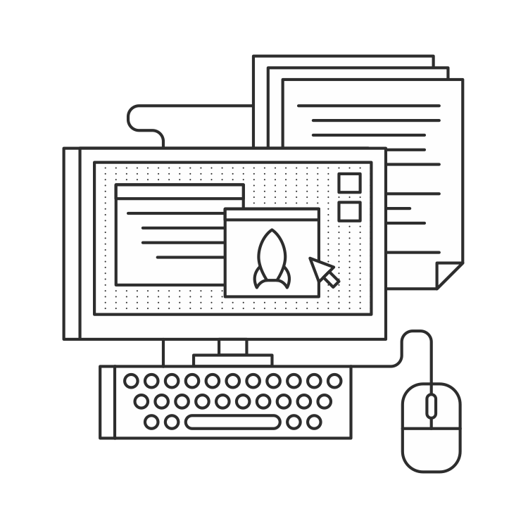

# Coding conventions

There are a number of conventions in the Python community to guide the way you format your code. If you’ve been developing with Python for a while, then you might already be familiar with some of these conventions. I’ll keep things brief and leave a few URLs where you can find more information if you haven’t come across these topics before.

## Let’s have a PEP rally!

A **PEP** is a “Python Enhancement Proposal.” These proposals are indexed and hosted at python.org [http://www.python.org/dev/peps/]. In the index, PEPs are grouped into a number of categories, including meta-PEPs, which are more informational than technical. The technical PEPs, on the other hand, often describe things like improvements to Python’s internals.

There are a few PEPs, like PEP 8 and PEP 257 that affect the way we write our code. PEP 8 contains coding style guidelines. PEP 257 contains guidelines for docstrings, the generally accepted method of documenting code.

### PEP 8: Style Guide for Python Code

PEP 8 is the official style guide for Python code. I recommend that you read it and apply it’s recommendations to your Flask projects (and all other Python code). Your code will be much more approachable when it starts growing to many files with hundreds, or thousands, of lines of code. The PEP 8 recommendations are all about having more readable code.

One particularly important recommendation is to use 4 spaces per indentation level. No real tabs. If you break this convention, it’ll be a burden on you and other developers when switching between projects. That sort of inconsistency is a pain in any language, but white-space is especially important in Python, so switching between real tabs and spaces could result in any number of errors that are very difficult to debug.

### PEP 257: Docstring Conventions

PEP 257 [LINK TO PEP] covers another Python standard: **docstrings**. You can read the definition and recommendations in the PEP itself, but here’s an example to give you an idea of what a docstring looks like:

```
def launch_rocket():
	"""Main launch sequence director.

	Kicks off each of the actions that need to be taken to launch the rocket.
	"""
	# [...]
```

These kinds of docstrings can be used by software such as [Sphinx](http://sphinx-doc.org/) to generate documentation files in HTML, PDF and other formats. They also contribute to making your code more approachable.

## Relative imports

Relative imports make life a little easier when developing Flask apps. The premise is simple. Previously, you might have specified the app's package name when importing internal modules:

```
from myapp.models import User
```
Using relative imports, you would indicate the relative location of the module using a dot notation where the first dot indicates the current directory and each subsequent dot represents the next parent directory.

```
from ..models import User
```

The advantage of this method is that the package becomes a heck of a lot more modular. Now you can rename your package and re-use modules from other projects without the need to update the hard-coded import statements.

{ SEE MORE:
* You can read a little more about the syntax for relative imports from this section in PEP 328: http://www.python.org/dev/peps/pep-0328/#guido-s-decision
* Here’s a Tweet that I came across that makes a good testimonial for using relative imports: https://twitter.com/dabeaz/status/372059407711887360
}


## Summary

* Try to follow the coding style conventions laid out in PEP 8.
* Try to document your app with docstrings as defined in PEP 257.
* Use relative imports to import your apps internal modules.
