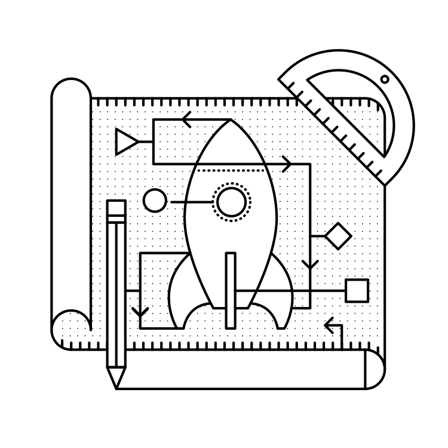

# Blueprints

## What is a blueprint?

A blueprint defines a collection of views, templates, static files, etc. that can be applied to an application. For example, let’s imagine that we have a blueprint for an admin panel. This blueprint would define the views for routes like _/admin/login_ and _/admin/dashboard_. It may also include the templates and static files to be served on those routes. You can then apply this blueprint for an admin panel to your app, be it a social network for astronauts or a CRM for rocket salesmen. Now your app has an admin panel.

## Why would you use blueprints?

The killer use-case of blueprints is to organize your application into distinct components. For a Twitter-like microblog, we might have a blueprint for the website pages, e.g. _index.html_ and _about.html_. Then we could have another for the logged-in dashboard where we show all of the latest posts and yet another for our administrator’s panel. Each distinct area of the site can be separated in the code as well. This allows you to structure your app has several smaller “apps” that each do one thing.

{ SEE ALSO: http://flask.pocoo.org/docs/blueprints/#why-blueprints }

## Where do you put them?

Like everything with Flask, there are many ways that you can organize your app using blueprints. With blueprints, I like to think of the choice as functional versus divisional (terms I'm borrowing from the business world).

### Functional structure

With a functional structure, you organize the pieces of your app by what they do. Templates are grouped together in one directory, static files in another and views in a third.

```
yourapp/
    __init__.py
    static/
    templates/
        home/
        control_panel/
        admin/
    views/
        __init__.py
        home.py
        control_panel.py
        admin.py
    models.py
```

With the exception of yourapp/views/__init__.py, each of the _.py_ files in the _yourapp/views/_ directory is a blueprint. In _yourapp/__init__.py_ we would import those blueprints and **register** them on our `Flask()` object. We’ll look a little more at how this is implemented later in this chapter. 

{ Note: At the time of writing this, the Flask website at flask.pocoo.org uses this structure. https://github.com/mitsuhiko/flask/tree/website/flask_website }

### Divisional

With the divisional structure, you organize the pieces of the application based on which part of the app they contribute to. All of the templates, views and static files for the admin panel go in one directory, and those for the user control panel go in another. 

```
yourapp/
    __init__.py
    admin/
        __init__.py
        views.py
        static/
        templates/
    home/
        __init__.py
        views.py
        static/
        templates/
    control_panel/
        __init__.py
        views.py
        static/
        templates/
    models.py
```

Here, each directory under _yourapp/_ is a separate blueprint. All of the blueprints are applied to the `Flask()` app in the top-level ___init__.py_

### Which one is best?

The organizational structure you choose is largely a personal decision. The only difference is the way the hierarchy is represented -- i.e. you can architect Flask apps with either methodology -- so you should choose the one that makes sense to you.

If your app has largely independent pieces that only share things like models and configuration, divisional might be the way to go. An example might be a SaaS app that lets user's build websites. You could have blueprints in "divisions" for the home page, the control panel, the user's website, and the admin panel. These components may very well have completely different static files and layouts. If you’re considering spinning off your blueprints as extensions or using them for other projects, a divisional structure will be easier to work with.

On the other hand, if the components of your app flow together a little more, it might be better represented with a functional structure. An example of this would be Facebook. If it were to use Flask, it might have blueprints for the home pages (i.e. signed-out home, register, about, etc.), the dashboard (i.e. the news feed), profiles (/robert/about and /robert/photos), even settings (/settings/security and /settings/privacy) and many more. These components all share a general layout and styles, but each has its own layout as well. Here's a heavily abridged version of what Facebook might look like it if were built with Flask:

```
facebook/
    __init__.py
    templates/
        layout.html
        home/
            layout.html
            index.html
            about.html
            signup.html
            login.html
        dashboard/
            layout.html
            news_feed.html
            welcome.html
            find_friends.html
        profile/
            layout.html
            timeline.html
            about.html
            photos.html
            friends.html
            edit.html
        settings/
            layout.html
            privacy.html
            security.html
            general.html
    views/
        __init__.py
        home.py
        dashboard.py
        profile.py
        settings.py
    static/
        style.css
        logo.png
    models.py
```

The blueprints in _facebook/views/_ are little more than collections of views rather than wholy independent components. The same static files will be used for the views in most of the blueprints. Most of the templates will extend a master template. A functional structure is a good way to organize this project.

## How do you use them?

### Basic usage

Let's take a look at the code for one of the Blueprints from that Facebook example:

facebook/views/profile.py
```
from flask import Blueprint, render_template

profile = Blueprint('profile', __name__)

@profile.route('/<user_url_slug>')
def timeline(user_url_slug):
    # Do some stuff
    return render_template('profile/timeline.html')

@profile.route('/<user_url_slug>/photos')
def photos(user_url_slug):
    # Do some stuff
    return render_template('profile/photos.html')

@profile.route('/<user_url_slug>/about')
def about(user_url_slug):
    # Do some stuff
    return render_template('profile/about.html')
```

To create a blueprint object, you import the `Blueprint()` class and initialize it with the parameters `name` and `import_name`. Usually `import_name` will just be `__name__`, which is a special Python variable containing the name of the current module.

{ NOTE: When using a divisional structure, you’d want to tell Flask that the blueprint has its own template and static directories. Here’s what our definition would look like in that case:

```
profile = Blueprint('profile', __name__, template_folder='templates', static_folder='static')
```
}

We have now defined our blueprint. It's time to extend our Flask app with it by registering it.

facebook/__init__.py
```
from flask import Flask
from .views.profile import profile

app = Flask(__name__)
app.register_blueprint(profile)
```

Now the routes defined in _facebook/views/profile.py_ (e.g. `/<user_url_slug>`) are registered on the application, and act just as if you'd defined them with `@app.route()`.

### Using a dynamic URL prefix

Continuing with the Facebook example, notice how all of the profile routes start with the `<user_url_slug>` portion and pass that value to the view. We want users to be able to access a profile by going to a URL like _http://facebook.com/john.doe_. We can stop repeating ourselves by defining a dynamic prefix for all of the blueprint's routes.

Blueprints let us define both static and dynamic prefixes. We can tell Flask that all of the routes in a blueprint should be prefixed with _/profile_ for example; that would be a static prefix. In the case of the Facebook example, the prefix is going to change based on which profile the user is viewing. Whatever text they choose is the URL slug of the profile which we should display; this is a dynamic prefix.

We have a choice to make when defining our prefix. We can define the prefix in one of two places: when we instantiate the `Blueprint()` class or when we register it with `app.register_blueprint()`.

Here we are setting the url_prefix on instantiation:

facebook/views/profile.py
```
from flask import Blueprint, render_template

profile = Blueprint('profile', __name__, url_prefix='/<user_url_slug>')

# [...]
```

Here we are setting the url_prefix on registration:

facebook/__init__.py
```
from flask import Flask
from .views.profile import profile

app = Flask(__name__)
app.register_blueprint(profile, url_prefix='/<user_url_slug>')
```

While there aren’t any technical limitations to either method, it’s nice to have the prefixes available in the same file as the registrations. This makes it easier to move things around from the top-level. For this reason, I recommend the latter method.

We can use converters in the prefix, just like in route() calls. This includes any custom converters that we've defined. When doing this, we can automatically process the value passed in the blueprint-wide prefix. In this case we’ll want to grab the user object based on the URL slug passed into a view in our profile blueprint. We'll do that by decorating a function with `url_value_preprocessor()`.

facebook/views/profile.py
```
from flask import Blueprint, render_template, g

from ..models import User

# The prefix is defined in facebook/__init__.py.
profile = Blueprint('profile', __name__)

@profile.url_value_preprocessor
def get_profile_owner(endpoint, values):
    query = User.query.filter_by(url_slug=values.pop('user_url_slug'))
    g.profile_owner = query.first_or_404()

@profile.route('/')
def timeline():
    return render_template('profile/timeline.html')

@profile.route('/photos')
def photos():
    return render_template('profile/photos.html')

@profile.route('/about')
def about():
    return render_template('profile/about.html')
```

We're using the `g` object to store the profile owner and g is available in the Jinja2 template context. This means that for a barebones case all we have to do in the view is render the template. The information we need will be available in the template.

facebook/templates/profile/photos.html
```



    

```

{ SEE ALSO: The Flask documentation has a great tutorial on using this technique for internationalizing your URLs. http://flask.pocoo.org/docs/patterns/urlprocessors/#internationalized-blueprint-urls }

### Using a dynamic subdomain

Many SaaS (Software as a Service) applications these days provide users with a subdomain from which to access their software. Harvest, for example, is a time tracking application for consultants that gives you access to your dashboard from yourname.harvestapp.com. Here I'll show you how to get Flask to work with automatically generated subdomains like this.

For this section I'm going to use the example of an application that lets users create their own websites. Imagine that our app has three blueprints for distinct sections: the home page where users sign-up, the user administration panel where the user builds their website and the user's website. Since these three parts are relatively unconnected, we'll organize them in a divisional structure.

```
sitemaker/
    __init__.py
    home/
        __init__.py
        views.py
        templates/
            home/
        static/
            home/
    dash/
        __init__.py
        views.py
        templates/
            dash/
        static/
            dash/
    site/
        __init__.py
        views.py
        templates/
            site/
        static/
            site/
    models.py
```

{ TABLE ME }

{ ENCODE BACKER NAME IN SUBDOMAIN }

* sitemaker.com/ : _sitemaker/home_ - Just a vanilla blueprint. Views, templates and static files for _index.html_, _about.html_ and _pricing.html_.
* bigdaddy.sitemaker.com : _sitemaker/site_ - This blueprint uses a dynamic subdomain and includes the elements of the user’s website. We’ll go over some of the code used to implement this blueprint below.
* bigdaddy.sitemaker.com/admin : _sitemaker/dash_ - This blueprint could use both a dynamic subdomain and a URL prefix by combining the techniques in this section with those from the previous section.

We can define our dynamic subdomain the same way we defined our URL prefix. Both options (in the blueprint directory or in the top-level ___init__.py_) are available, but once again we’ll keep the definitions in _sitemaker/__init.py___.

sitemaker/__init__.py
```
from flask import Flask
from .site import site

app = Flask(__name__)
app.register_blueprint(site, subdomain='<site_subdomain>')
```

In a divisional structure, the blueprint will be defined in _sitemaker/site/__init__.py_. 

sitemaker/site/__init__py
```
from flask import Blueprint

from ..models import Site

"""Note that the capitalized Site and the lowercase site
are two completely separate variables. Site is a model
and site is a blueprint.
"""
site = Blueprint('site', __name__)

@site.url_value_preprocessor
def get_site(endpoint, values):
    query = Site.query.filter_by(subdomain=values.pop('site_subdomain'))
    g.site = query.first_or_404()

"""Import the views after site has been defined. The views module will need to import 'site' so we need to make sure that we import views after site has been defined.
"""
import .views
```

Now we have the site information from the database that we’ll use to display the user’s site to the visitor who requests their subdomain.

To get Flask to work with subdomains, you’ll need to specify the `SERVER_NAME` configuration variable.

config.py
```
SERVER_NAME = 'sitemaker.com'
```

{ NOTE: A few minutes ago, as I was drafting this section, somebody in IRC said that their subdomains were working fine in development, but not in production. I asked if they had the SERVER_NAME configured, and it turned out that they had it in development but not production. Setting it in production solved their problem. See the conversation between myself (imrobert) and aplavin: http://dev.pocoo.org/irclogs/%23pocoo.2013-07-30.log }

{ NOTE: You can set both a subdomain and url_prefix. Think about how we would configure the blueprint in _sitemaker/dash_with the URL structure from the table above. }

## Refactoring small apps to use blueprints

I’d like to go over a brief example of the steps we can take to convert an app to use blueprints. We’ll start off with a typical Flask app and restructure it.
{ ENCODE BACKER NAME? }
Here’s our growing app — called gnizama — that’s in need of some reorganization:

```
config.txt
requirements.txt
run.py
gnizama/
  __init__.py
  views.py
  models.py
  templates/
  static/
tests/
```

The _views.py_ file has grown to 10,000 lines of code. We’ve been putting off refactoring it, but it’s finally time. The file contains views for all of the sections of our site. These sections are the home page, the user dashboard, the admin dashboard, the API and the company blog.

### Step 1: Divisional or functional?

This application is made up of very distinct sections. Templates and static files probably aren’t going to be shared between blueprints, so we’ll go with a divisional structure.

### Step 2: Move some files around

{ WARNING: Before you make any changes to your app, commit everything to version control. You don’t want to accidentally delete something for good. }

Next we’ll go ahead and create the directory tree for our new app. Start off by creating a folder for each blueprint within the package directory. Then copy _views.py_, _static/_ and _templates_ in their entirety to each blueprint directory. You can then remove them from the top-level package directory.

```
config.txt
requirements.txt
run.py
gnizama/
  __init__.py
  home/
    views.py
    static/
    templates/
  dash/
    views.py
    static/
    templates/
  admin/
    views.py
    static/
    templates/
  api/
    views.py
    static/
    templates/
  blog/
    views.py
    static/
    templates/
  models.py
tests/
```

### Step 3: Cut the crap

Now we can go into each blueprint and remove the views, static files and templates that don’t apply to that blueprint. How you go about this step largely depends on how you’re app was organized to begin with. 

The end result should be that each blueprint has a `views.py` file with all of the views for that blueprint. No two blueprints should define a view for the same route. Each _templates/_ directory should only include the templates for the views in that blueprint. Each _static/_ directory should only include the static files that should be exposed by that blueprint.

{ NOTE: Make it a point to eliminate all unnecessary imports. It’s easy to forget about them, but at best they clutter your code and at worst they slow down your application. }

### Step 4: Blueprint...ifi...cation or something of that nature

This is the part where we turn our directories into blueprints. The key is in the ___init__.py_ files. For starters, let’s take a look at the definition of the API blueprint.

_gnizama/api/__init__.py_
```
from flask import Blueprint

api = Blueprint(
    'site',
    __name__,
    template_folder='templates',
    static_folder='static'
)

import .views
```

Then we can register this blueprint in the gnizama package’s top-level ___init__.py_ file.

_gnizama/__init__.py_
```
from flask import Flask
from .api import api

app = Flask(__name__)

"""Puts the API blueprint on api.gnizama.com."""
app.register_blueprint(api, subdomain='api')
```

Make sure that the routes are registered on the blueprint now rather than the app object. Here’s what an API route might have looked like in _gnizama/views.py_ before we refactored our application:

_gnizama/views.py_
```
from . import app

@app.route('/search', subdomain='api')
def api_search():
    pass
```

In a blueprint it would look like this:

_gnizama/api/views.py_
```
from . import api

@api.route('/search')
def search():
    pass
```

### Step 5: Enjoy

Now our application is far more modular than it was with one massive _views.py_ file. The route definitions are simpler because we group them together into blueprints and configure things like subdomains and URL prefixes once for each blueprint.

## Summary

* A blueprint is a collection of views, templates, static files and other extensions that can be applied to an application.
* Blueprints are a great way to organize your application.
* A divisional structure is where each blueprint is a collection of views, templates and static files which constitute a particular section of your application.
* A functional structure is where each blueprint is just a collection of views. The templates are all kept together, as are the static files.
* To use a blueprint, you define it then register it on the application with `Flask.register_blueprint().`.
* You can define a dynamic URL prefix that will be applied to all routes in a blueprint.
* You can also define a dynamic subdomain for all routes in a blueprint.
* Refactoring a growing application to use blueprints can be done in five small steps.
